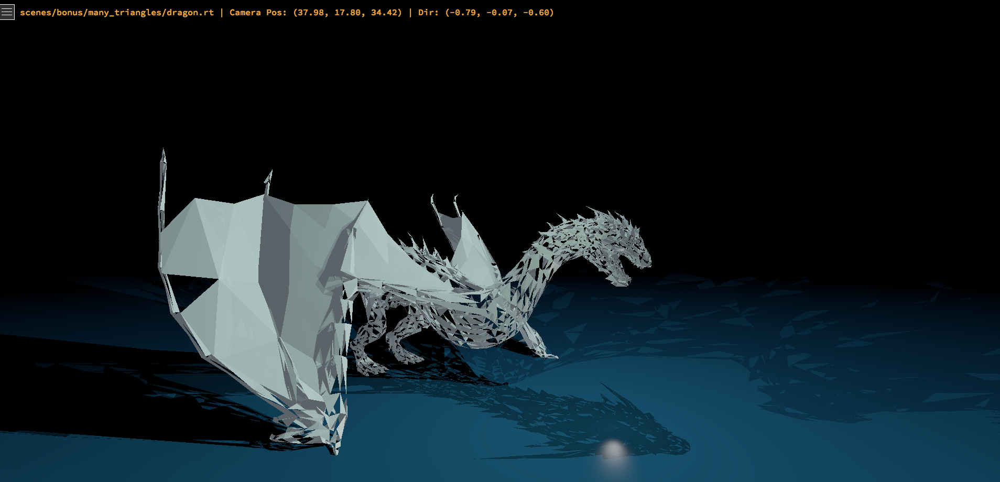
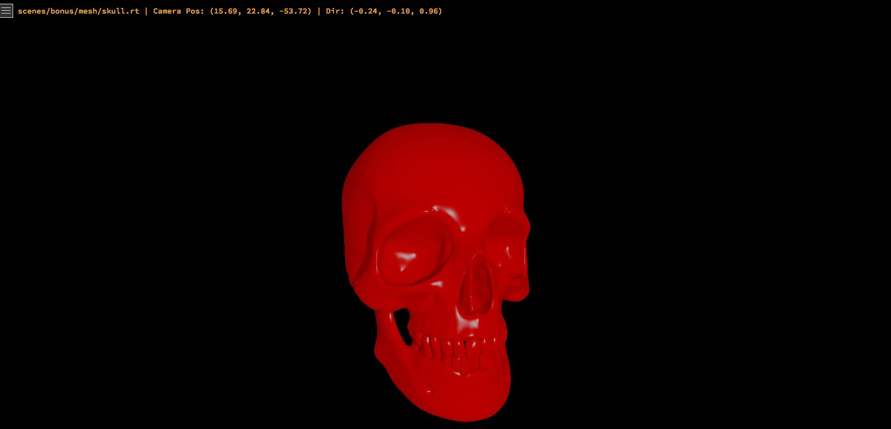
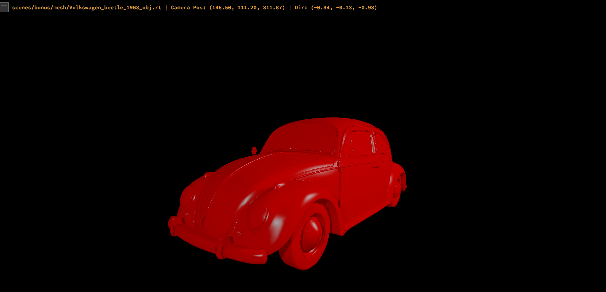

# miniRT - Ray Tracing Engine


A high-performance ray tracing engine written in C, capable of rendering photorealistic 3D scenes with advanced lighting, materials, and geometric shapes. This project implements a complete ray tracer from scratch using mathematical algorithms for realistic light simulation.

## 🎯 Project Overview

miniRT is a ray tracing renderer that simulates the physical behavior of light to create realistic images. The engine traces rays from the camera through each pixel of the screen, calculating how light interacts with objects in the 3D scene to produce the final image.

### How Ray Tracing Works

1. **Ray Generation**: For each pixel on the screen, a ray is cast from the camera through that pixel into the 3D scene
2. **Intersection Testing**: The ray is tested against all objects in the scene to find the closest intersection point
3. **Lighting Calculation**: At the intersection point, lighting is calculated based on:
   - Direct illumination from light sources
   - Material properties (color, reflectivity, transparency)
   - Surface normals and viewing angles
4. **Recursive Reflection/Refraction**: Additional rays are cast for reflective and refractive materials
5. **Color Accumulation**: All lighting contributions are combined to determine the final pixel color

## 🚀 Features

### Core Ray Tracing Engine
- **Multi-threaded rendering** for optimal performance (8 threads in bonus, 1 in mandatory)
- **Bounding Volume Hierarchy (BVH)** for fast ray-object intersection
- **Anti-aliasing** with configurable sample rates
- **HDR rendering** with tone mapping and gamma correction

### Supported Geometric Primitives
- **Spheres** - Perfect geometric spheres with customizable radius
- **Planes** - Infinite flat surfaces with normal vectors
- **Cylinders** - Finite cylinders with caps
- **Cones** - Geometric cones with apex and base
- **Cubes** - Axis-aligned and rotated cubes
- **Triangles** - Individual triangular surfaces
- **3D Meshes** - Complex models loaded from OBJ files

### Advanced Materials & Textures
- **Physically-based Materials**:
  - Reflectivity (mirror-like surfaces)
  - Refractivity with realistic Fresnel effects
  - Specular highlights with configurable shininess
  - Transparency with light transmission
- **Texture Mapping**: PNG/JPG texture support with UV coordinate mapping
- **Bump Mapping**: PPM height maps for surface detail simulation
- **Procedural Textures**: Checkerboard patterns with configurable size and colors

### Lighting System
- **Multiple Light Sources**: Support for unlimited point lights
- **Ambient Lighting**: Global illumination simulation
- **Colored Lighting**: RGB light sources for artistic effects
- **Soft Shadows**: Realistic shadow attenuation through transparent objects
- **Light Intensity Control**: Configurable brightness levels

### Interactive Controls
- **Real-time Camera Movement**:
  - WASD for movement
  - Mouse rotation for looking around
  - Smooth camera transitions
- **Rendering Options Panel**:
  - Toggle reflections, refractions, shadows
  - Adjust anti-aliasing samples
  - Enable/disable various effects
- **Live Status Display**: Real-time rendering information

## 🛠️ Technical Implementation

### Performance Optimizations
- **BVH Acceleration Structure**: Spatial partitioning for O(log n) intersection tests
- **Multi-threading**: Parallel rendering across CPU cores
- **Memory Management**: Efficient allocation and cleanup
- **SIMD Optimizations**: Vectorized mathematical operations where possible

### Mathematical Foundations
- **Ray-Object Intersection**: Analytical solutions for geometric primitives
- **Linear Algebra**: 3D vector mathematics and transformations
- **Fresnel Equations**: Physically accurate reflection/refraction ratios
- **Color Theory**: Linear color space and tone mapping

### Scene Format
The engine uses a custom `.rt` scene format supporting:
```
# Camera: position, direction, field_of_view
C 0,0,-10 0,0,1 60

# Ambient lighting: intensity, color
A 0.1 255,255,255

# Point light: position, intensity, color
L 10,15,0 0.6 255,255,255

# Sphere: center, diameter, color, {material_properties}
sp 0,0,0 6 255,0,0 {reflectivity:0.8 specular:0.9}

# Plane: point, normal, color, {material_properties}
pl 0,-5,0 0,1,0 0,255,0 {texture:wood.png}

# Cylinder: center, axis, diameter, height, color
cy 7,0,0 0,1,0 2 6 50,255,50

# Mesh: file, position, rotation, scale, color
me skull.obj 0,0,0 0,0,0 1 255,255,255

```

## 🎨 Scene Examples

### Mandatory Features
- **Basic Shapes** (`scenes/mandatory/basic_shapes.rt`)
  ![Placeholder: Basic geometric shapes - sphere, plane, cylinder]

- **Multiple Objects** (`scenes/mandatory/multiple_objects.rt`)
  ![Placeholder: Complex scene with multiple overlapping objects]


### Bonus Features

#### Advanced Materials
- **Reflectivity Showcase** (`scenes/bonus/reflectivity.rt`)
  ![Placeholder: Mirror-like spheres reflecting environment]

- **Refraction Demo** (`scenes/bonus/refractivety.rt`)
  ![Placeholder: Glass objects with light refraction]

#### Lighting Effects
- **Colored Lights** (`scenes/bonus/colored_lights/`)
  ![Placeholder: Scene with red, green, and blue lights mixing]

- **Three Lights** (`scenes/bonus/three_lights.rt`)
  ![Placeholder: Dramatic lighting with multiple colored sources]

#### Textures & Materials
- **Textured Surfaces** (`scenes/bonus/textured/`)
  ![Placeholder: Objects with wood, stone, and earth textures]

- **Checkerboard Patterns** (`scenes/bonus/checker_board/`)
  ![Placeholder: Procedural checkerboard on various shapes]

#### Complex Models

- **Triangles - Dragon** (`scenes/bonus/many_triangles/dragon.rt`)
  


- **3D Meshes - Skull** (`scenes/bonus/mesh/`)
  

- **3D Meshes - Volkswagen** (`scenes/bonus/Volkswagen_beetle_1963_obj.rt`)
  

## 🔧 Building and Running

### Prerequisites
- GCC compiler with C99 support
- GLFW for window management
- OpenGL for graphics acceleration

### Compilation
```bash
# Clone the repository
git clone [your-repo-url] miniRT
cd miniRT

# Build the project
make

# For bonus features
make bonus

# Clean build files
make clean    # Remove object files
make fclean   # Remove all generated files
make re       # Full rebuild
```

### Usage
```bash
# Render a scene file
./miniRT scenes/mandatory/basic_shapes.rt

# With bonus features
./miniRT_bonus scenes/bonus/reflectivity.rt
```

### Controls
- **Movement**: WASD keys
- **Mouse**: Look around by moving mouse
- **UI Panel**: Click the toggle button (top-left) to open settings
- **ESC**: Exit the program

## 🎓 What I Learned

### Computer Graphics Fundamentals
- **Ray Tracing Theory**: Understanding how light simulation creates realistic images
- **3D Mathematics**: Vector operations, transformations, and projections
- **Color Theory**: Linear color spaces, gamma correction, and tone mapping
- **Spatial Data Structures**: BVH trees for performance optimization

### Advanced Programming Concepts
- **Multi-threading**: Parallel processing for performance optimization
- **Memory Management**: Efficient allocation and cleanup in C
- **Performance Optimization**: Profiling and optimizing critical code paths
- **Mathematical Programming**: Implementing complex algorithms from research papers

### Graphics Programming
- **Shader-like Programming**: Implementing material systems similar to modern shaders
- **Texture Mapping**: UV coordinate systems and sampling algorithms
- **Lighting Models**: Phong shading, Fresnel equations, and physically-based rendering
- **Anti-aliasing**: Sampling theory and image quality improvement

## 🎯 Technical Challenges Overcome

1. **Performance Optimization**: Implemented BVH trees reducing intersection tests from O(n) to O(log n)
2. **Numerical Stability**: Handled floating-point precision issues in ray-surface intersections
3. **Memory Management**: Efficient handling of large 3D meshes and texture data
4. **Multi-threading**: Synchronized parallel rendering without race conditions
5. **Mathematical Complexity**: Implemented Fresnel equations and physically accurate light transport

## 🏆 Bonus Features Implemented

- ✅ **Multiple Light Sources** - Unlimited colored point lights
- ✅ **Reflections** - Mirror-like surfaces with recursive ray tracing
- ✅ **Refractions** - Glass materials with Fresnel effects
- ✅ **Texture Mapping** - PNG/JPG texture support
- ✅ **Bump Mapping** - Surface detail from height maps
- ✅ **3D Mesh Loading** - OBJ file format support
- ✅ **Additional Primitives** - Cones, cubes, triangles
- ✅ **Procedural Textures** - Checkerboard patterns
- ✅ **Multi-threading** - Parallel rendering
- ✅ **Interactive UI** - Real-time controls and settings
- ✅ **Anti-aliasing** - Configurable sample rates
- ✅ **Soft Shadows** - Realistic shadow rendering

## 📊 Performance Metrics

- **Rendering Speed**: ~2-5 seconds for 1920x1080 complex scenes (8-core CPU)
- **Memory Usage**: Optimized for scenes with 10K+ triangles
- **BVH Acceleration**: 10-100x speedup on complex meshes
- **Multi-threading**: Near-linear scaling with CPU cores


---

*This project represents a deep dive into computer graphics programming, demonstrating mastery of mathematical concepts, performance optimization, and complex system design. The ray tracer produces photorealistic images while maintaining real-time interactivity through advanced optimization techniques.*
